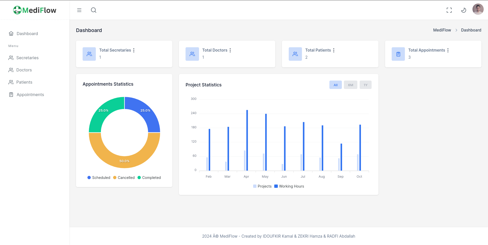
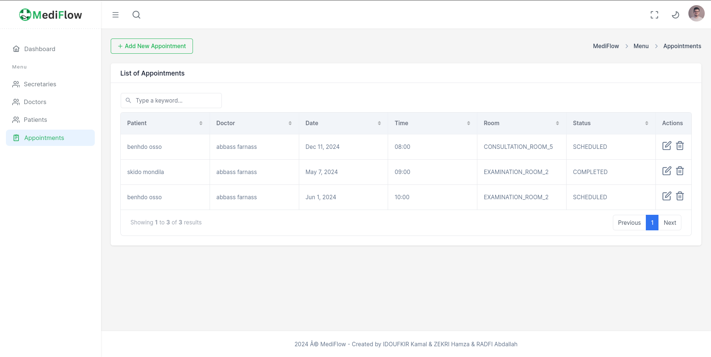

# MediFlow - Medical Appointment Management System

MediFlow is a web-based medical appointment management system developed using the MVC pattern. It facilitates the management of appointments, patients, doctors, and secretaries. The system provides separate functionalities for two roles: secretary and admin. Secretaries can manage appointments and patients, while admins have additional privileges to manage doctors and secretaries.

<div style="display: flex;justify-content: center;align-items: center;flex-direction: column;">
        
        
      </div>

## Technologies Used

- **Jakarta Servlets** 
- **JDBC (Java Database Connectivity)**
- **MYSQL:**
- **JSP (JavaServer Pages)**
- **HTML, JavaScript, Tailwind CSS**
- **Build Tool:** Maven

## Project Setup

To set up the project, follow these steps:

1. Clone the repository to your local machine.
2. Open the project in IntelliJ IDEA.
3. Ensure you have Apache Tomcat configured in your IntelliJ IDEA.
4. Create a `resources` folder in the following path: `src/main/`.
5. Inside the `resources` folder, create a file named `config.properties`. Add the following content to it:

    ```
    username=root
    password=password
    ```

   Replace `username` and `password` with your MySQL database credentials.

6. Import the `dbTables.sql` file to set up the database schema.
7. The default admin credentials are as follows:
    - Username: 'doe'
    - Password: 'password' (encrypted using SHA-256 and output format is base64)

## Usage

1. Start Apache Tomcat server.
2. Access the application through your web browser.
3. Log in using the provided credentials for either the admin.
4. If you want to log in as secretary, create an account for it as the admin first.
5. Begin managing appointments, patients, doctors, and secretaries as per your role permissions.


Feel free to contribute to this project by submitting pull requests or raising issues.
